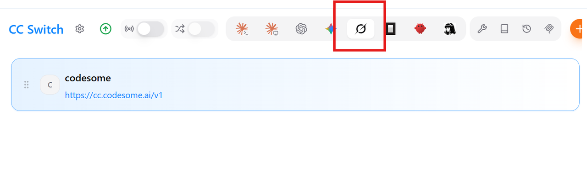
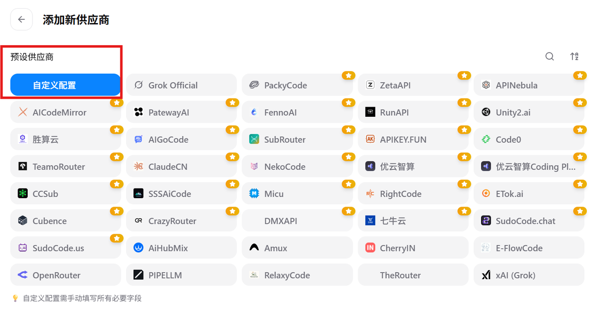
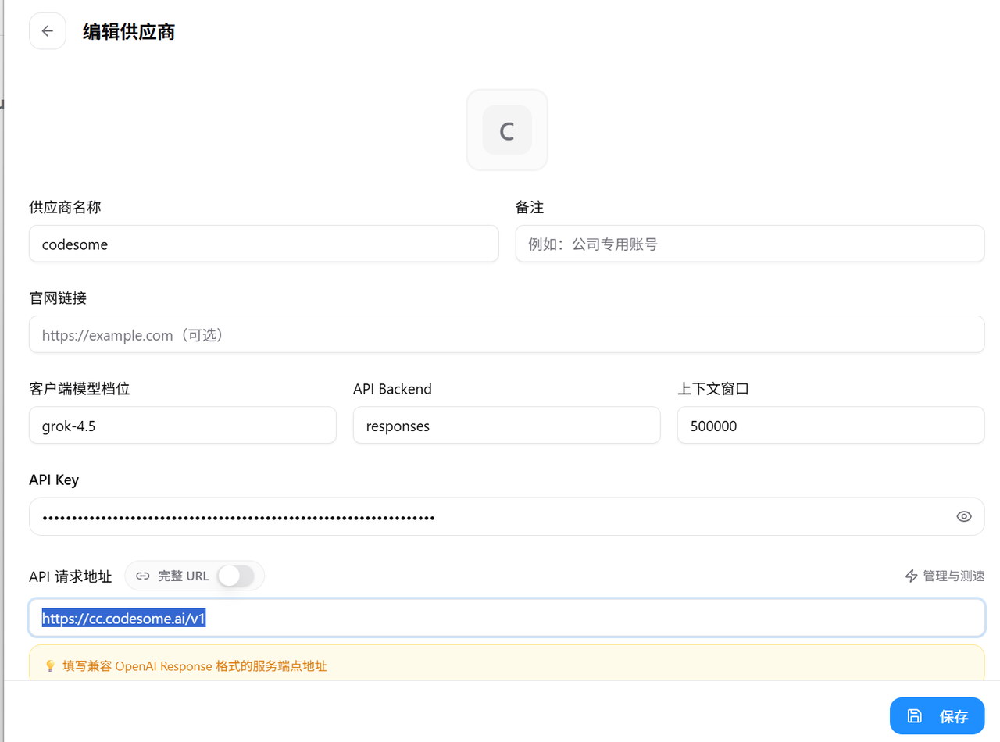

# V3 Grok Build 安装与配置指南

> 面向 **V3 套餐**用户：在 **Grok Build**（xAI 官方 CLI）中接入 Codesome 的 **Grok 4.5** 模型，直接在终端里用 Grok 写代码、查资料、跑 Agent 任务。

**一句话回答**：安装 Grok Build CLI → 用 **CC Switch** 配置 Codesome V3 请求地址与 API Key（推荐，图形界面），或手动编辑 `~/.grok/config.toml` → 运行 `grok` 即可。

## 适用范围

| 项目 | 说明 |
|---|---|
| 套餐 | V3（`cc.codesome.ai`，API Key 以 `sk-` 开头） |
| 模型 | `grok-4.5` |
| 客户端 | Grok Build CLI（xAI 官方命令行工具） |

> 二合一/月卡套餐请参考对应的二合一教程。

### 两种配置方式

| 方式 | 说明 | 推荐 |
|---|---|---|
| **方案 A：CC Switch 配置** | 图形界面，填写名称、API Key、请求地址即可，简单直观 | ★ 推荐优先 |
| 方案 B：手动编辑 config.toml | 纯文本配置，适合想完全掌控配置的用户 | 备选 |

---

## 第一步：安装 Grok Build CLI

### macOS 安装

**官方推荐方式（一键安装）：**

```bash
curl -fsSL https://x.ai/cli/install.sh | bash
```

* 适用于 macOS（Apple Silicon / Intel）、Linux、Git Bash；
* 会自动下载对应架构的二进制，安装到 `~/.grok/bin/`，并尽量处理 PATH。

**Homebrew 方式（有 Homebrew 的用户）：**

```bash
brew install --cask grok-build
```

**验证安装：**

```bash
grok --version
```

> **安全提示**：如果担心 `curl | bash`，可先下载脚本查看再执行：
>
> ```bash
> curl -fsSL https://x.ai/cli/install.sh -o install.sh
> # 检查内容后
> bash install.sh
> ```

### Windows 安装

**官方推荐方式（PowerShell）：**

在 **PowerShell**（非 CMD）中运行：

```powershell
irm https://x.ai/cli/install.ps1 | iex
```

* 自动下载 Windows 二进制（`grok.exe` 等），安装到 `%USERPROFILE%\.grok\bin\`，并添加到用户 PATH；
* 安装完成后建议**重新打开**一个新的 PowerShell 窗口。

**其他方式：**

* **winget**：

  ```powershell
  winget install --id xAI.GrokBuild -e
  ```

* **WSL2**（熟悉 Linux 的用户）：在 WSL 内使用 macOS/Linux 的 bash 命令即可；
* **Git Bash** 也可使用 bash 安装脚本。

**验证安装：**

```powershell
grok --version
```

### 安装后通用步骤

1. 首次启动：`cd 你的项目目录` 后运行 `grok`；
2. 更新：`grok update`。

如果遇到 PATH 问题，重启终端或手动把 `~/.grok/bin`（Windows 对应路径）加入 PATH 即可。

---

## 第二步：配置 Codesome V3 Grok 模型

### 方案 A（推荐）：用 CC Switch 配置

**1. 下载并安装 CC Switch**

* 打开下载页：<https://github.com/farion1231/cc-switch/releases>；
* 在 Assets 区域选择对应系统的安装包：macOS 选 `.dmg`，Windows 选 `.msi`；
* 如果 GitHub 打不开，在 Codesome 用户群 / 客服群里说明需要 CC Switch 安装包，让客服或管理员发最新版；
* 不要从第三方网盘或来路不明的页面下载，CC Switch 会接触 API Key。

> 更详细的 CC Switch 下载与安装说明见 [CC Switch 配置 Claude 桌面端教程](ccswitch-claude)。

**2. 打开 CC Switch，选择 Grok**

打开 CC Switch 主界面，点击右上角的图标切换到 **Grok**：



**3. 新建自定义配置**

切换到 Grok 页面后，点击右上角的 **加号（+）** 新建一个自定义配置：



**4. 填写三个必要信息**

| 字段 | 填写内容 |
|---|---|
| 配置名称 | 随意填写，例如 `Grok 4.5` |
| API Key | 你的 V3 API Key（`sk-` 开头，从 Codesome 网站获取） |
| 请求地址 | `https://cc.codesome.ai/v1` |

完整配置如图所示：



**5. 保存并开始使用**

填写完毕后点击右下角的**保存**，然后打开终端输入 `grok` 即可开始使用。

> 常见问题：找不到这个配置页面，说明你的 CC Switch 版本太旧，需要更新到最新版（更新方式见 CC Switch 文档）。

### 方案 B（备选）：手动编辑 config.toml

**1. 找到配置文件**

Grok Build 的配置文件是：

* macOS / Linux：`~/.grok/config.toml`
* Windows：`%USERPROFILE%\.grok\config.toml`

**2. 写入配置**

创建（或编辑）该文件，粘贴下面的完整配置，并把 `api_key` 替换成你自己的 V3 API Key：

```toml
[models]
default = "grok"
web_search = "grok"

[model."grok"]
model = "grok-4.5"
base_url = "https://cc.codesome.ai/v1"
name = "Grok 4.5"
api_key = "sk-请替换成你的API Key"
api_backend = "responses"
context_window = 1000000
supports_backend_search = true
```

> **小提示**：如果你不想把 Key 明文写在配置文件里，也可以改用 `env_key = "XAI_API_KEY"`，并在终端里 `export XAI_API_KEY=你的Key`。

**配置项说明**

| 配置项 | 示例值 | 作用 |
|---|---|---|
| `[models] default` | `"grok"` | 默认使用的模型，值对应下面的 `[model."grok"]` 别名 |
| `[models] web_search` | `"grok"` | 客户端联网搜索（`web_search` 工具）使用的模型 |
| `[model."grok"] model` | `"grok-4.5"` | 实际发给 API 的模型 ID |
| `base_url` | `"https://cc.codesome.ai/v1"` | Codesome V3 API 地址 |
| `name` | `"Grok 4.5"` | 在模型选择器中显示的名称 |
| `api_key` | 你的 Key | V3 API Key（`sk-` 开头） |
| `api_backend` | `"responses"` | 使用 OpenAI Responses 协议 |
| `context_window` | `1000000` | 上下文窗口长度，影响自动压缩时机 |
| `supports_backend_search` | `true` | Codesome 端点支持服务端搜索工具 |

---

## 第三步：验证配置

```bash
grok inspect
```

确认配置已生效。再确认模型已加载：

```bash
grok models
```

应该能看到类似输出：

```text
Default model: grok

Available models:
  - grok-4.5
  * grok (default)
```

也可以直接提问测试：

```bash
grok -p "你好"
```

---

## 第四步：开始使用

### 交互模式（推荐）

```bash
cd /path/to/your-project
grok
```

### 单次提问（Headless）

```bash
grok -p "帮我写一个 Python 冒泡排序"
```

### 切换模型

在交互界面输入 `/model`，或启动时指定：

```bash
grok -m grok
```

### 常用命令

| 命令 | 作用 |
|---|---|
| `grok` | 进入交互模式 |
| `grok -p "问题"` | 单次提问后退出 |
| `grok -m grok` | 指定模型启动 |
| `grok inspect` | 查看当前生效配置 |
| `grok models` | 列出可用模型 |
| `grok update` | 更新 Grok Build CLI |
| `grok doctor` | 检查终端环境 |

---

## 联网搜索

Grok Build 默认启用联网搜索：

* 方案 B 配置中 `[models] web_search = "grok"` 指定搜索使用的模型；
* `supports_backend_search = true` 表示 Codesome 端点支持服务端搜索工具。

如需临时关闭联网，可加参数启动：

```bash
grok --disable-web-search
```

---

## 故障排查

### 找不到 CC Switch 的配置页面

说明你的 CC Switch 版本太旧，更新到最新版即可（详见 CC Switch 文档）。

### 401 Unauthorized

API Key 不对或已过期。检查填写的 Key 是否正确、前后没有多余空格。

### 404 Not Found

* 检查请求地址 / `base_url` 是否为 `https://cc.codesome.ai/v1`，不要漏掉 `/v1`；
* 方案 B 中 `api_backend = "responses"` 时，请求会打到 `/v1/responses`。

### empty response from model

* 确认账户有可用余额；
* 确认 API Key 属于 V3 套餐（`sk-` 开头）。

---

## 官方文档

* Grok Build 官方文档：<https://docs.x.ai/build/overview>
* Grok Build 配置说明：<https://docs.x.ai/build/settings>
* Grok CLI 主页：<https://x.ai/cli>
* Grok Build 源码仓库：<https://github.com/xai-org/grok-build>

---

## 相关文档

* [CC Switch 配置 Claude 桌面端教程](ccswitch-claude)
* [V3 Claude Code 安装与配置指南](v3-claude)
* [V3 Codex 安装与配置指南](v3-codex)
* [V3 OpenCode 配置指南](v3-opencode)
* [第三方客户端接入 Codesome 配置指南](third-party-clients)
