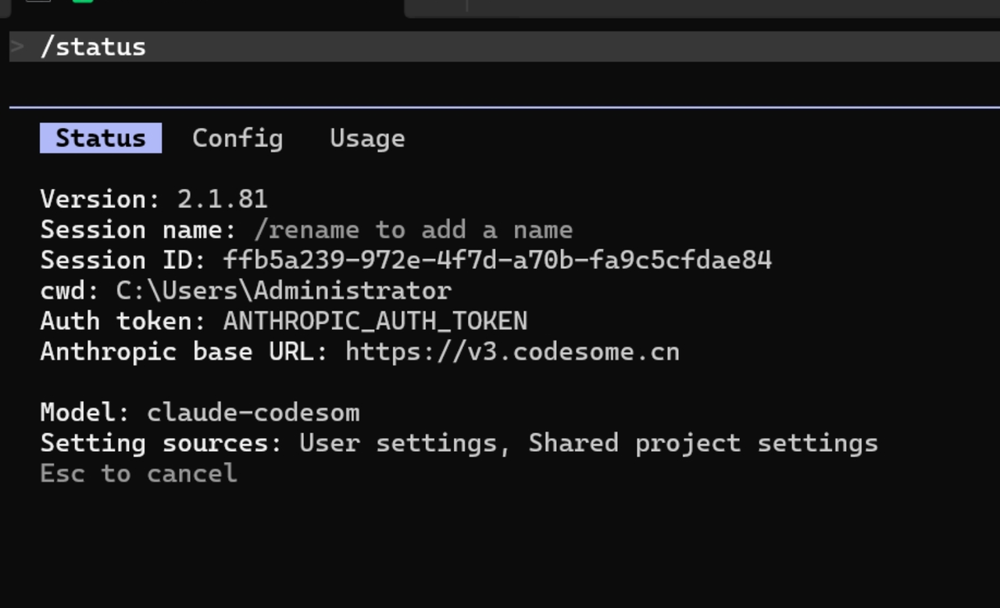
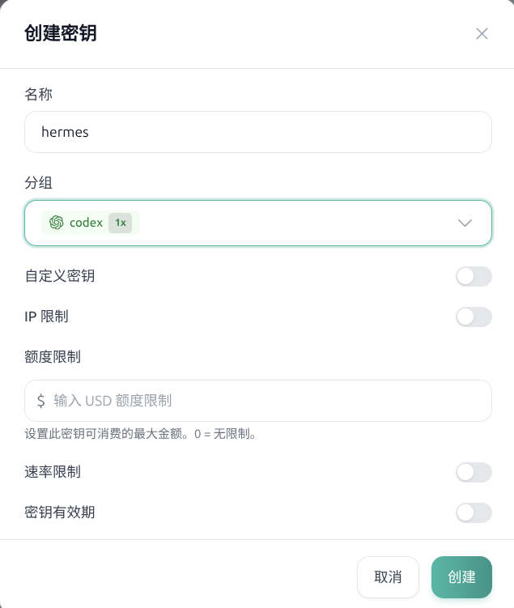
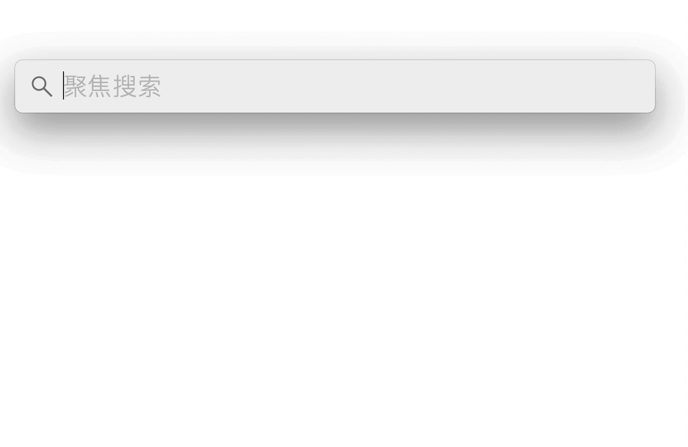
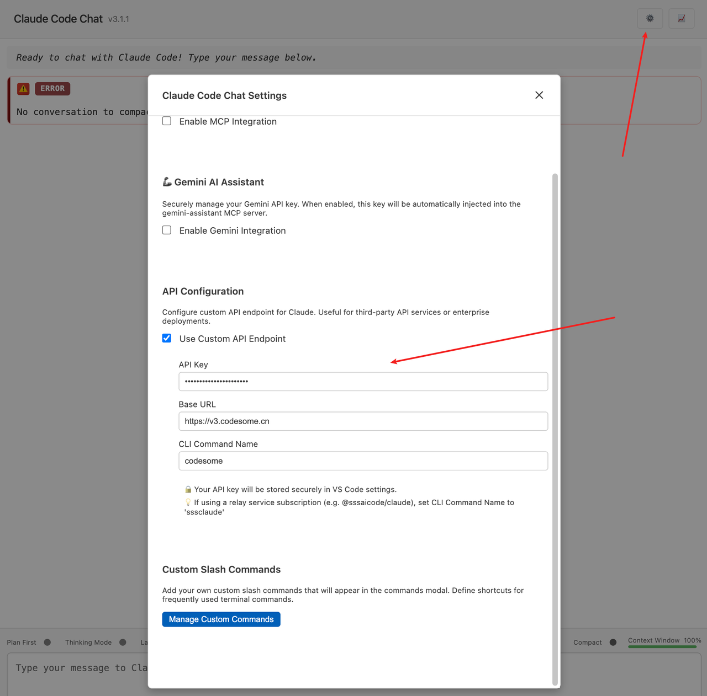

》》[ codesome｜Claude code 小白无门槛宝典](03-Agentic入门宝典.md) （点击扫码进群一起畅玩 cc）

# 有手就行，如何使用skill全自动配置hermes

首先安装trae等ai agent软件

然后把以下内容粘贴给ai

````bash
---
name: hermes
description: 当用户希望安装、修复、迁移、验证或配置 Hermes 时使用，尤其适用于 CodeSome Codex / Claude、多 profile 场景、gateway / channel 问题，以及 Hermes / Telegram 传输故障。
---

# Hermes 安装与修复

把自己当成安装与修复向导，不要当成 shell 教程。

## 范围边界

这个 skill 只处理 Hermes。

它覆盖：

- Hermes CLI
- `~/.hermes` 下的 Hermes profiles
- Hermes 的 `config.yaml` 和 `.env`
- Hermes gateway 与 channel 配置
- Hermes 模型 / provider 集成

## 这个 Skill 处理什么

- 全新安装 Hermes
- 修复已有 Hermes 环境
- 将 Hermes 迁移到 CodeSome Codex 或 Claude
- 在做 gateway 工作前先验证模型路径
- 多 profile 隔离
- gateway 与 channel 故障排查
- 中国大陆环境下的 Telegram 连接失败

## 触发条件

当 Hermes 明确在问题范围内时使用这个 skill，尤其包括：

- 安装 Hermes
- 修复 Hermes
- 配置 Hermes
- Hermes 无法工作
- 把 Hermes 迁移到 CodeSome
- 配置多个 Hermes profiles
- 用 Hermes 配置 Feishu / Telegram / Slack
- 为 Hermes 配置 CodeSome Codex
- 为 Hermes 配置 CodeSome Claude
- 为 Hermes 设置 `OPENAI_API_KEY`
- 为 Hermes 设置 `CODESOME_CLAUDE_API_KEY`

如果 Hermes 不在请求范围内，不要因为只是设置通用 API key 就路由到这里。

## 硬规则

1. 先检查，再编辑。
2. 在编辑任何已有 Hermes config 或 env 文件之前，先备份。
3. 在碰 gateway 或 channel 配置之前，先验证模型路径。
4. 把每个 Hermes profile 都当成独立实例处理。
5. 在目标验证返回 `HERMES_OK` 之前，绝不要报告成功。
6. 绝不要把 gateway 或 channel 问题误判成模型路径问题。
7. 修复时尽量保留已知正常的配置段。

## 安装模式

内部选择一种模式：

- 快速安装：一个实例、一个 provider 路径、可选一个 channel。
- 修复已有环境：先检查、保留原有布局、最小化修改。
- 多 profile 配置：分别处理 profile、分别验证、分别解决 channel 冲突。

## 检测阶段

确定以下内容：

- 安装模式
- 目标 profiles
- 目标 channels
- provider 模式
- 选中的配置路径

Provider 提示：

- Codex 路径：`gpt-5.5`、Codex、Responses API、`OPENAI_API_KEY`、CodeSome Codex
- Claude 路径：Claude、`claude-sonnet-4-6`、`claude-opus-4-6`、`CODESOME_CLAUDE_API_KEY`、CodeSome Claude

如果两条路径都存在，优先采用用户明确指定的请求。如果用户说得很模糊，但当前工作路径已经很明显，则默认保持原状，除非修复过程必须切换。

对于 CodeSome Codex，使用方式是：

- 先走 preferred path
- 只有 Hermes 拒绝 preferred provider 时才走 fallback path

把 fallback 呈现为安装器的自动修复行为，而不是要用户自己理解的概念分支。

## 备份策略

在编辑任何现有文件前，始终创建一个带时间戳的备份目录。

默认实例：

```bash
TS=$(date +%Y%m%d_%H%M%S)
mkdir -p ~/.hermes/backups/$TS
[ -f ~/.hermes/config.yaml ] && cp ~/.hermes/config.yaml ~/.hermes/backups/$TS/config.yaml.bak
[ -f ~/.hermes/.env ] && cp ~/.hermes/.env ~/.hermes/backups/$TS/.env.bak
```

命名 profiles：

```bash
TS=$(date +%Y%m%d_%H%M%S)
mkdir -p ~/.hermes/backups/$TS/main ~/.hermes/backups/$TS/educator
[ -f ~/.hermes/profiles/main/config.yaml ] && cp ~/.hermes/profiles/main/config.yaml ~/.hermes/backups/$TS/main/config.yaml.bak
[ -f ~/.hermes/profiles/main/.env ] && cp ~/.hermes/profiles/main/.env ~/.hermes/backups/$TS/main/.env.bak
[ -f ~/.hermes/profiles/educator/config.yaml ] && cp ~/.hermes/profiles/educator/config.yaml ~/.hermes/backups/$TS/educator/config.yaml.bak
[ -f ~/.hermes/profiles/educator/.env ] && cp ~/.hermes/profiles/educator/.env ~/.hermes/backups/$TS/educator/.env.bak
```

在阶段更新和最终结果里，都要报告备份路径。

## 检查阶段

在做任何编辑前先检查：

```bash
hermes version
hermes profile list
cat ~/.hermes/config.yaml
cat ~/.hermes/.env
```

对于命名 profiles：

```bash
cat ~/.hermes/profiles/main/config.yaml
cat ~/.hermes/profiles/main/.env
cat ~/.hermes/profiles/educator/config.yaml
cat ~/.hermes/profiles/educator/.env
```

在相关情况下还要检查：

- 是否存在 wrapper scripts
- gateway 是否已经在运行
- 关键 env vars 是否已设置
- 当报运行时问题时，要看 gateway 日志和进程状态

常用运行时检查：

```bash
ps aux | grep hermes
cat ~/.hermes/gateway_state.json
tail -100 ~/.hermes/logs/errors.log
tail -50 ~/.hermes/logs/gateway.log
```

## CodeSome Codex 配置

首选路径：

```yaml
model:
  default: "gpt-5.5"
  provider: "codesome-codex"
  context_length: 2000000

custom_providers:
  - name: "codesome-codex"
    base_url: "https://cc.codesome.ai/v1"
    api_mode: "codex_responses"
    models:
      gpt-5.5:
        context_length: 2000000

terminal:
  backend: "local"
  cwd: "."
  timeout: 180
```

必需的 env var：

```bash
OPENAI_API_KEY=your_c..._key
```

回退路径：

```yaml
model:
  default: gpt-5.5
  provider: custom
  base_url: https://cc.codesome.ai/v1
  api_mode: codex_responses
  context_length: 2000000

terminal:
  backend: local
  cwd: .
  timeout: 180
```

把 key 放在 `OPENAI_API_KEY` 里。

## CodeSome Claude 配置

```yaml
model:
  default: "claude-sonnet-4-6"
  provider: "codesome-claude"
  context_length: 2000000

custom_providers:
  - name: "codesome-claude"
    base_url: "https://cc.codesome.ai"
    api_key: "${CODESOME_CLAUDE_API_KEY}"
    api_mode: "anthropic_messages"
    models:
      claude-sonnet-4-6:
        context_length: 2000000
      claude-opus-4-6:
        context_length: 2000000

terminal:
  backend: "local"
  cwd: "."
  timeout: 180
```

必需的 env var：

```bash
CODESOME_CLAUDE_API_KEY=***
```

## 验证策略

模型验证闸门：

```bash
hermes version
hermes chat -q "Reply with exactly: HERMES_OK"
```

对于命名 profiles：

```bash
hermes -p main chat -q "Reply with exactly: HERMES_OK"
hermes -p educator chat -q "Reply with exactly: HERMES_OK"
```

如果存在 wrapper scripts，也可以这样验证：

```bash
main chat -q "Reply with exactly: HERMES_OK"
educator chat -q "Reply with exactly: HERMES_OK"
```

只有在模型验证通过之后，这个 skill 才应该继续运行：

```bash
hermes doctor
```

或者继续执行任何 gateway / channel 配置命令。

结果解释：

- `HERMES_OK`：模型路径正常。
- `Unknown provider 'codesome-codex'`：切换到 fallback path，然后重新验证。
- `401 INVALID_API_KEY`：key 错了、过期了，或者放进了错误的 env var。
- 任何其他失败：停止更深层配置，先修模型层。

## 多 Profile 模型

每个 profile 都是独立的 Hermes 实例：

- 默认实例：`~/.hermes`
- 命名实例：`~/.hermes/profiles/<name>`

创建 profiles：

```bash
hermes profile create main --clone
hermes profile create educator --clone
```

使用 profiles：

```bash
hermes -p main chat
hermes -p educator chat
```

每个 profile 都遵循以下规则：

- 检查 profile 文件
- 备份 profile 文件
- 设置 profile config
- 设置 profile env
- 验证 profile
- 只有在这些都完成后，才配置该 profile 的 gateway 与 channels

绝不要因为一个 profile 健康，就假设所有 profiles 都健康。

## Gateway 与 Channel 策略

只有在该 profile 的模型验证通过后，才配置 gateway。

验证后允许使用的命令：

```bash
hermes gateway setup
main gateway setup
educator gateway setup
hermes gateway run --replace
main gateway run --replace
educator gateway run --replace
```

如果某个 channel 在模型验证通过后仍然失败，就保持模型层为 PASS，并把问题隔离到 gateway 或运行时层面。

```

## 输出契约

阶段更新应长这样：

```md
[Hermes Setup]

Stage X/Y: <阶段名>

Detected:
- ...

Decision:
- ...

Changed:
- ...

Next:
- ...

Rollback:
- available at <backup_path>
```

最终结果应明确拆分：

- config 层
- env var 层
- 模型路径
- gateway
- channel
- 备份路径
- 总体状态

状态含义：

- model path PASS 且没有请求 channel -> READY
- model path PASS，但请求的 channel 被阻塞 -> PARTIALLY READY
- model path FAIL -> NOT READY

绝不要把所有东西模糊地合并成一句“完成了”。

````

最后告诉ai，在这台电脑上帮我配置

# Mac 小白版：从零配好 hermes

## 一、安装 Git

打开终端，然后输入：

```powershell
git --version
```

如果你看到了版本号，比如：

```powershell
git version 2.39.3
```

说明 Git 已经装好了，可以继续下一步。

如果系统提示找不到 `git`，或者没有正常显示版本号，就先安装 Git。

在终端输入：

```powershell
brew install git
```

## 二、安装 Hermes

运行官方安装命令：

```powershell
curl -fsSL https://raw.githubusercontent.com/NousResearch/hermes-agent/main/scripts/install.sh | bash
```

安装完成后，重新加载 shell：

```bash
source ~/.zshrc
```

如果你不是 zsh，也可以试一下：

```bash
source ~/.bashrc
```

然后确认 Hermes 已经装好：

```bash
hermes version
```

## 三、配置模型

先创建配置目录：

```bash
mkdir -p ~/.hermes
```

然后打开配置文件：

```bash
nano ~/.hermes/config.yaml
```

把下面这段内容直接粘进去（codex月卡）（使用 control + v）：

```yaml
model:
  default: "gpt-5.5"
  provider: "codesome-codex"
  context_length: 2000000

custom_providers:
  - name: "codesome-codex"
    base_url: "https://cc.codesome.ai/v1"
    api_mode: "codex_responses"
    models:
      gpt-5.5:
        context_length: 2000000

terminal:
  backend: "local"
  cwd: "."
  timeout: 180

```

或者也可以使用这个配置：（claude月卡）

```yaml
model:
  default: "claude-sonnet-4-6"
  provider: "codesome-claude"
  context_length: 2000000

custom_providers:
  - name: "codesome-claude"
    base_url: "https://cc.codesome.ai"
    api_key: "${CODESOME_CLAUDE_API_KEY}"
    api_mode: "anthropic_messages"
    models:
      claude-sonnet-4-6:
        context_length: 2000000
      claude-opus-4-6:
        context_length: 2000000

terminal:
  backend: "local"
  cwd: "."
  timeout: 180

```

保存并退出：

* 按 `Control + O` 保存（这是字母 o）

* 按回车确认

* 按 `Control + X` 退出

## 四、去后台创建 API key

打开 Codesome 后台，左侧找到 `API 密钥`，点右上角 `创建密钥`。



选择 codex 分组，创建完成后，点复制按钮，把你的 API key 复制下来。



## 五、填写你的 API Key

打开 Hermes 的密钥文件：

```powershell
nano ~/.hermes/.env

```

加入这一行，把值替换成你自己的 key：（使用 control + v粘贴）

```bash
OPENAI_API_KEY=你的apikey

```

这里虽然叫 `OPENAI_API_KEY`，但实际是拿来给 Codesome Codex 用的，因为这个接口走的是 OpenAI Responses 格式。

注意，如果刚才使用了claude的配置，你要用下面这个

```powershell
CODESOME_CLAUDE_API_KEY=你的真实key
```

保存并退出：

* 按 `Control + O` 保存

* 按回车确认

* 按 `Control + X` 退出

## 六、验证模型配置

先确认模型能正常工作，运行：

```bash
hermes chat -q "Reply with exactly: HERMES_OK"

```

如果返回了：

```plain&#x20;text
HERMES_OK

```

如图：



说明你的模型配置已经通了，可以继续下一步。

## 七、配置聊天机器人

以上模型验证通过后，再继续接下来的操作。

在终端运行：

```powershell
hermes gateway setup

```

进去以后选择你想要的渠道：



跟随向导，一步一步完成配置。

## 八、常用命令

启动 CLI

```bash
hermes
```

直接问一句话

```bash
hermes chat -q "请用最简单的话告诉我 Hermes 能做什么"
```

继续上一次会话

```bash
hermes -c
```

检查配置有没有问题

```bash
hermes doctor
```

开一个新对话

进入 Hermes 以后输入：

```plain&#x20;text
/new
```

## 九、常见错误

### 401错误

常见于claude的配置，因为hermes会自动读取来自系统的claudecode的环境变量，因此，在启动的时候，要去除这个变量
