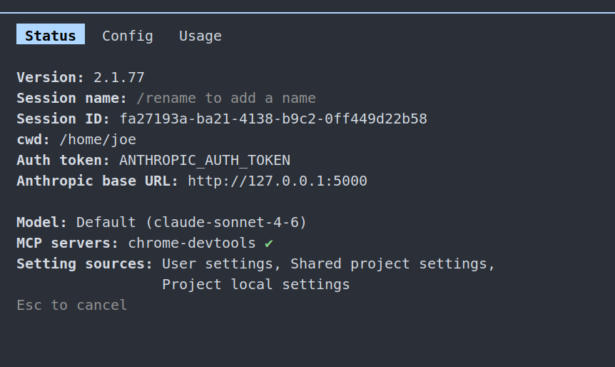
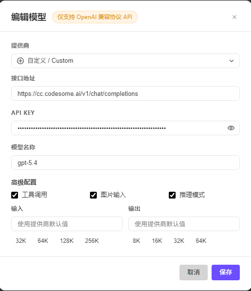
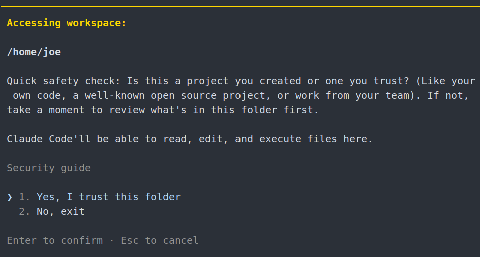
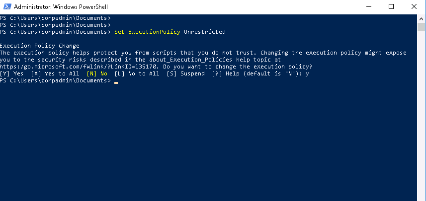
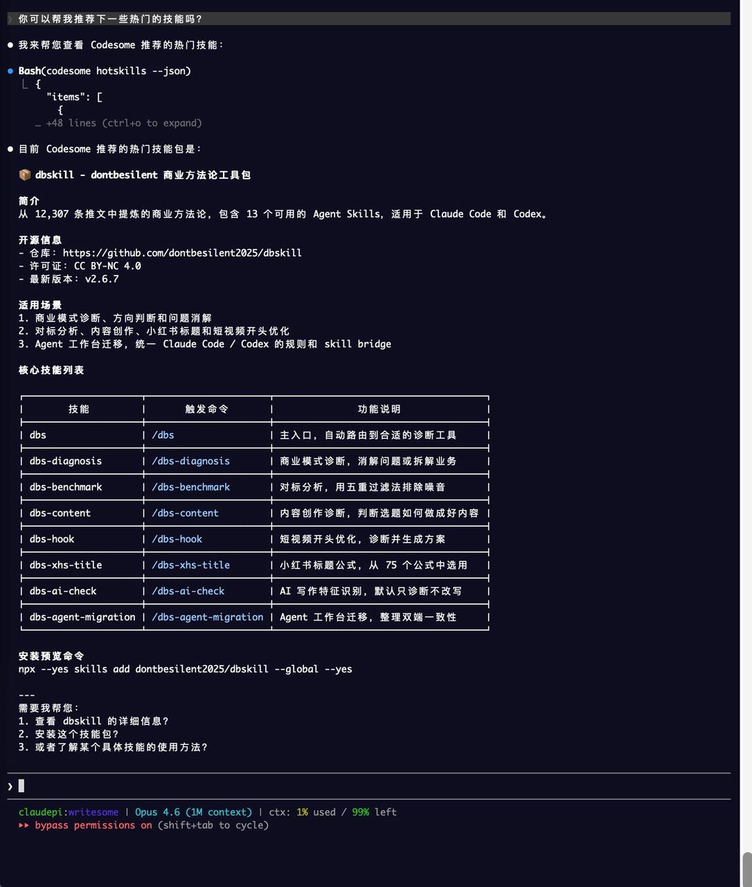
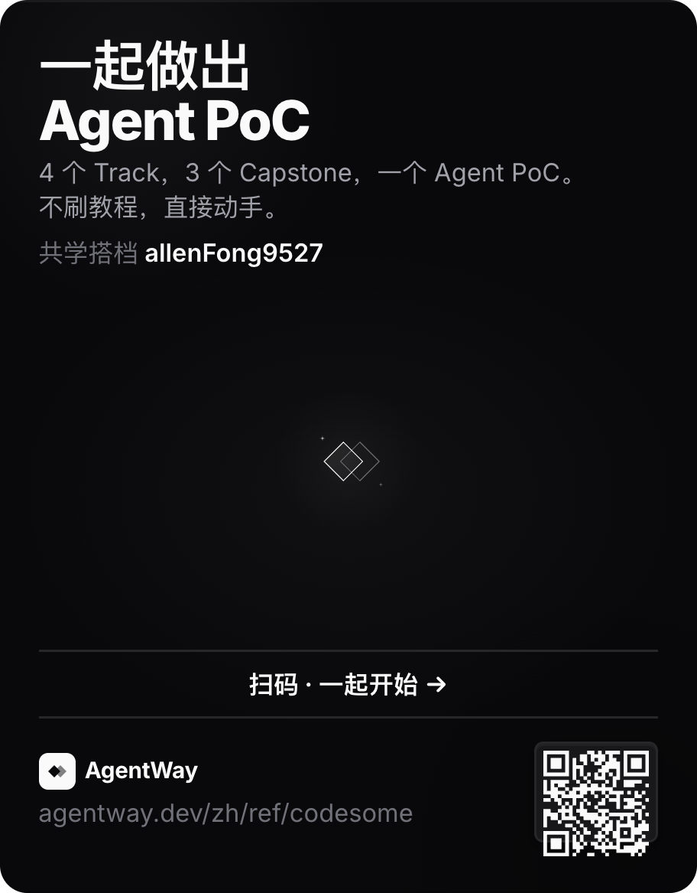

> 这篇是使用中问题清单，可以比其他文档长。它负责处理“已经购买、已经兑换、已经配置后遇到的问题”。如果你还没买、还没兑换、还没创建 API Key，先看主文档里的购买和配置入口。

## 使用前先确认

| 先确认               | 为什么                                             |
| ----------------- | ----------------------------------------------- |
| 你知道自己用的是 V3 还是二合一 | 两者入口、key 形态和 base URL 不一样                       |
| 你已经完成兑换或拿到对应 key  | V3 通常先兑换再创建 `sk-...`；二合一常见是 `cr-...`，不走 V3 主站兑换 |
| 你已经创建或拿到了 API Key | 兑换码不能直接配置客户端                                    |
| API Key 分组正确      | 月卡、按量、Codex、Claude Code 分组不能混用                  |
| 客户端配置的是正确地址       | V3、二合一、Claude Code、Codex 对应地址不同                 |
| 终端或客户端已重启         | 环境变量常常要新开窗口才生效                                  |

常用地址：

| 场景                          | 地址                                 |
| --------------------------- | ---------------------------------- |
| 下单购买                        | `https://fk.codesome.cn/`                        |
| V3 后台 / 兑换 / API Key / 使用记录 | `https://v3.codesome.cn/dashboard` |
| 二合一主界面                      | `https://v5.codesome.cn`           |
| 服务状态                        | `https://status.codesome.cn`       |

## 1. 下单、兑换、分组与 API Key 怎么理解

如果你是第一次使用 codesome，先把几个入口和概念区分清楚：

* 下单页面用于购买套餐、月卡或充值，入口是 `https://fk.codesome.cn/`。

* V3 API 后台用于查看余额、兑换、管理 API 密钥和使用记录，入口是 `https://v3.codesome.cn/dashboard`。

* 兑换码不是 API Key。兑换码用于充值或兑换套餐，API Key 用于配置 Claude Code、Codex 或其他客户端。

* V3 用户通常要先在后台兑换，再到“API 密钥”页面创建 `sk-...` API Key。

* 二合一用户使用独立入口 `https://v5.codesome.cn`，常见 key 是 `cr-...`，不要去 V3 主站兑换。

### 分组是什么，该怎么选？

在 API 密钥页面，每个密钥都有一个分组。分组决定这个 key 走哪一种模型、套餐或计费规则。

* 如果你买的是月卡或订阅套餐，优先选择对应订阅分组。

* 如果你只是按余额使用，选择对应按量分组。

* `codex` 通常用于 Codex 相关使用；`pro-cc`、`max-cc`、`max-3.5` 等分组对应不同倍率和模型能力。

* 如果不确定选哪个，优先选和购买套餐名称最接近、并且页面标记为订阅或官方的分组。

* 已经创建好的 key 通常也可以在 API 密钥列表里调整分组；调整后建议重启终端或客户端。

### API Key 是什么？

API Key 是客户端连接 codesome 服务时使用的密钥。V3 常见是 `sk-...`，二合一常见是 `cr-...`。

请注意：

* 不要把完整 API Key 发到公开群、截图或文档里。

* 文档和客服沟通里只展示脱敏形式，例如 `sk-****abcd` 或 `cr-****abcd`。

* 如果怀疑 key 泄露，可以在 API 密钥页面禁用或删除旧 key，再重新创建。

### 如何新建 API Key？

V3 用户：

1. 打开 `https://v3.codesome.cn/keys`。

2. 左侧点击“API 密钥”。

3. 点击“创建密钥”。

4. 填写名称，例如 `claude-code`、`codex` 或设备名。

5. 选择与你购买套餐或使用场景匹配的分组。

6. 创建后复制 API Key，并保存到安全位置。

7. 回到 Claude Code、Codex 或对应客户端配置页面，把这个 API Key 填进去。

二合一用户：

1. 打开 `https://v5.codesome.cn`。

2. 使用二合一页面提供的 `cr-...` key。

3. Claude Code 使用 `https://v5.codesome.cn/api`。

4. Codex / OpenAI 格式客户端使用 `https://v5.codesome.cn/openai`。

### GPT-5.6 和 Fable5 的当前边界

GPT-5.6 请填写精确模型 ID：

* `gpt-5.6-terra`：日常任务，推荐作为默认值。
* `gpt-5.6-sol`：高难度任务，成本更高。
* `gpt-5.6-luna`：简单任务或批量任务。

不要填写裸 `gpt-5.6`，它会默认指向更贵的 Sol。若客户端看不到 5.6，先升级 Codex / 客户端，再检查配置中的模型 ID。

Fable5 不再作为当前配置项。客服于 2026 年 7 月 15 日明确：2026 年 7 月 19 日之后无法使用 Fable，不影响其他模型。不要继续创建 Fable 配置或尝试 `/model fable`；如果未来后台重新显示该模型，请以当天后台模型列表、分组状态和平台公告为准。

## 2. 502 报错

现象：客户端返回 502，或者请求中断。

常见原因：

* 上下文太大。

* 长对话持续续聊。

* 读取或写入内容太多导致断流。

先做这几步：

1. 如果是 Claude Code 长对话，先执行 `/compact` 压缩上下文。

2. 新开一个窗口，只带必要背景继续。

3. 长文档和大文件分批处理，不要一次让模型吞全部内容。

4. 如果仍然出现，保留报错截图、当前工具、当前分组信息再找客服。

示例截图：



## 3. 503 报错

现象：请求返回 503，模型不可用或分组不可用。

常见原因：

* 当前分组上游不可用。

* 月卡或某个按量分组处于波动状态。

* 客户端里自定义了不必要的模型名称。

如果你是月卡分组：

1. 打开 `https://status.codesome.cn` 查看 monthly 或对应订阅分组状态。

2. 如果状态不是绿色，可以等待月卡渠道恢复。

3. 如果急用，可以临时购买按量付费，并切换到可用按量分组。

如果你是按量分组：

1. 打开 `https://status.codesome.cn`。

2. 找到状态正常的按量分组。

3. 回到 API Key 页面切换分组，或换一个配置到可用分组的 key。

重要提醒：使用 ccswitch 等 API 管理工具时，不要随意自定义模型名称；模型名称保持默认或按教程填写。

下图用于判断 status 分组状态和 ccswitch 里是否误填了自定义模型名称。




## 4. Unable to connect to anthropic services / failed to connect to api.anthropic.com: ERR\_BAD\_REQUEST

现象：Claude Code 提示无法连接 Anthropic 服务，或报 `ERR_BAD_REQUEST`。

常见原因：

* `ANTHROPIC_BASE_URL` 没有正确配置。

* `ANTHROPIC_AUTH_TOKEN` 填错或仍然是占位文本。

* 旧环境变量残留。

* 看错配置文档：用 V3 教程配置二合一，或用二合一教程配置 V3。

先做这几步：

1. 确认你配置的是 Claude Code，不是 Codex。

2. 确认自己是 V3 还是二合一。

3. V3 Claude Code 地址应为 `https://cc.codesome.ai`。

4. 二合一 Claude Code 地址应为 `https://v5.codesome.cn/api`。

5. 检查 `ANTHROPIC_AUTH_TOKEN` 是否是真实 API Key。

6. 清理旧环境变量后重新配置。

示例截图：



## 5. 已按教程完成配置，但仍然无法使用

按顺序检查：

1. API Key 是否真实，不是兑换码。

2. API Key 分组是否和套餐匹配。

3. 配置文档是否看对：V3 / 二合一、Claude Code / Codex 不能混用。

4. 是否新开了终端或重启客户端。

5. 是否有旧环境变量残留。

6. 当前分组状态是否异常。

7. 如果使用二合一，是否用了 `cr-...` key 和 v5 地址。

如果仍然不行，把以下信息发给客服：

```text
我使用的工具：Claude Code / Codex / Hermes / 其他
系统：Windows / macOS / Linux / WSL
购买类型：V3 月卡 / V3 按量 / 二合一月卡
当前分组：
配置地址：
报错截图：
我已经做过的步骤：
```

## 6. Unable to connect to API (ECONNRESET)

现象：连接被重置，或者客户端提示无法连接 API。

常见原因：

* 当前网络环境拦截。

* 公司 Wi-Fi、防火墙、代理设置影响。

* 客户端仍然使用旧地址。

先做这几步：

1. 切换手机热点测试。

2. 关闭不必要代理或换网络。

3. 检查 base URL 是否正确。

4. 如果家里能用、公司不能用，优先判断为公司网络拦截。

示例截图：



## 7. codesome 官方地址

常用地址如下：

| 用途                    | 地址                                 |
| --------------------- | ---------------------------------- |
| 下单购买                  | `https://fk.codesome.cn/`                        |
| V3 后台                 | `https://v3.codesome.cn/dashboard` |
| V3 Claude Code 地址     | `https://cc.codesome.ai`           |
| V3 Codex / OpenAI 地址  | `https://cc.codesome.ai/v1`        |
| 二合一主界面                | `https://v5.codesome.cn`           |
| 二合一 Claude Code 地址    | `https://v5.codesome.cn/api`       |
| 二合一 Codex / OpenAI 地址 | `https://v5.codesome.cn/openai`    |
| 状态页                   | `https://status.codesome.cn`       |

V4 已停止运行，不再作为新的购买或客户端配置入口；已有 V4 余额按客服流程转移到 V3。

## 8. 如何跳过 Claude Code 登录

如果 Claude Code 卡在登录或 onboarding，可以重置用户目录下的 `.claude.json`。

如果遇到下图这类登录或 onboarding 卡住的界面，可以按本节方式重置 `.claude.json`。



```bash
cat > ~/.claude.json <<'JSON'
{"hasCompletedOnboarding": true}
JSON
```

Windows 用户可以在 PowerShell 里执行等效操作。完成后重新打开终端，再按 Claude Code 配置指南重新配置。

## 9. CCSwitch 中的新版 Claude 模型 ID

2026 年 7 月 15 日客服曾针对新版 Claude 模型要求在 CCSwitch 的模型 ID 中填写 `claude-sonnet-5` 和 `claude-opus-4-8`。打开 CCSwitch 的配置，在“高级选项 / 模型映射”中按当前后台和客户端显示的模型填写：

| 字段             | 填写                          |
| -------------- | --------------------------- |
| 主模型            | `claude-sonnet-5`         |
| 推理模型（Thinking） | `claude-opus-4-8`           |
| Haiku 默认模型     | 不要设置 |
| Sonnet 默认模型    | `claude-sonnet-5`         |
| Opus 默认模型      | `claude-opus-4-8`           |

不要继续沿用旧的 4.6、4.7 或 Haiku ID；如果当前后台或客户端没有显示上述新版 ID，也不要强行填写，先以当天模型列表和平台公告为准。

CCSwitch 的模型映射位置如下图所示，界面可能随版本变化。



配置好之后点击保存，再重启终端或客户端验证。

## 10. 如果要恢复 Claude 的配置（到初始状态）

适合场景：你怀疑之前配置过别的 key、别的地址，导致新配置一直不生效。

Windows PowerShell 先删除用户级环境变量：

```powershell
reg delete HKCU\Environment /V ANTHROPIC_BASE_URL /F
reg delete HKCU\Environment /V ANTHROPIC_AUTH_TOKEN /F
reg delete HKCU\Environment /V CLAUDE_CODE_DISABLE_NONESSENTIAL_TRAFFIC /F
```

再删除当前会话里的临时环境变量：

```powershell
Remove-Item Env:ANTHROPIC_BASE_URL -ErrorAction SilentlyContinue
Remove-Item Env:ANTHROPIC_AUTH_TOKEN -ErrorAction SilentlyContinue
Remove-Item Env:CLAUDE_CODE_DISABLE_NONESSENTIAL_TRAFFIC -ErrorAction SilentlyContinue
```

验证：

```powershell
echo $env:ANTHROPIC_BASE_URL
echo $env:ANTHROPIC_AUTH_TOKEN
echo $env:CLAUDE_CODE_DISABLE_NONESSENTIAL_TRAFFIC
```

然后打开 `claude`，输入 `/logout`，完成后关闭所有终端，重新打开，再按配置指南重新配置。

## 11. 如何手动验证账单？

一条调用记录通常会包含：

| 类型       | 含义             |
| -------- | -------------- |
| 输入 token | 你让模型读取的内容      |
| 输出 token | 模型生成的内容        |
| 缓存创建     | 系统为后续复用创建缓存的部分 |
| 缓存读取     | 命中缓存后读取的部分     |

基础公式可以理解为：

```text
费用 = 输入费用 + 输出费用 + 缓存创建费用 + 缓存读取费用
最终扣费 = 费用 × 当前分组倍率
```

如果你觉得余额消耗异常，优先看：

1. 是否长对话一直续聊。

2. 输入 token 是否很高。

3. 输出是否很长。

4. 缓存读取是否很少。

5. 当前分组倍率是否比预期更高。

如果要精算单条记录，可以在 `https://v3.codesome.cn/usage` 找到这条调用的输入、输出、缓存创建、缓存读取 token，再按当时模型单价和分组倍率核对。

## 12. 如何快速删除 PowerShell 和环境变量配置里所有和 Claude / Anthropic 有关的变量

如果你之前在 Windows 的 PowerShell 里配置过 Claude Code / Anthropic 相关环境变量，后来想彻底清理干净，或者怀疑旧配置残留导致报错，可以按下面步骤操作。

先删除当前 PowerShell 会话里的临时环境变量：

```powershell
$names = @(
  "ANTHROPIC_API_KEY",
  "ANTHROPIC_AUTH_TOKEN",
  "ANTHROPIC_BASE_URL",
  "ANTHROPIC_MODEL",
  "CLAUDE_API_KEY",
  "CLAUDE_CODE_OAUTH_TOKEN",
  "CLAUDE_CODE_DISABLE_NONESSENTIAL_TRAFFIC",
  "CLAUDE_CODE_MAX_OUTPUT_TOKENS",
  "CLAUDE_CODE_USE_BEDROCK",
  "CLAUDE_CODE_USE_VERTEX",
  "CLAUDE_BEDROCK_BASE_URL"
)

foreach ($n in $names) {
  Remove-Item "Env:$n" -ErrorAction SilentlyContinue
}
```

再删除用户级 / 系统级持久环境变量：

```powershell
$names = @(
  "ANTHROPIC_API_KEY",
  "ANTHROPIC_AUTH_TOKEN",
  "ANTHROPIC_BASE_URL",
  "ANTHROPIC_MODEL",
  "CLAUDE_API_KEY",
  "CLAUDE_CODE_OAUTH_TOKEN",
  "CLAUDE_CODE_DISABLE_NONESSENTIAL_TRAFFIC",
  "CLAUDE_CODE_MAX_OUTPUT_TOKENS",
  "CLAUDE_CODE_USE_BEDROCK",
  "CLAUDE_CODE_USE_VERTEX",
  "CLAUDE_BEDROCK_BASE_URL"
)

foreach ($n in $names) {
  [Environment]::SetEnvironmentVariable($n, $null, "User")
  [Environment]::SetEnvironmentVariable($n, $null, "Machine")
}
```

最后验证是否已经删除成功：

```powershell
$names = @(
  "ANTHROPIC_API_KEY",
  "ANTHROPIC_AUTH_TOKEN",
  "ANTHROPIC_BASE_URL",
  "ANTHROPIC_MODEL",
  "CLAUDE_API_KEY",
  "CLAUDE_CODE_OAUTH_TOKEN",
  "CLAUDE_CODE_DISABLE_NONESSENTIAL_TRAFFIC",
  "CLAUDE_CODE_MAX_OUTPUT_TOKENS",
  "CLAUDE_CODE_USE_BEDROCK",
  "CLAUDE_CODE_USE_VERTEX",
  "CLAUDE_BEDROCK_BASE_URL"
)

foreach ($n in $names) {
  [PSCustomObject]@{
    Name    = $n
    Process = [Environment]::GetEnvironmentVariable($n, "Process")
    User    = [Environment]::GetEnvironmentVariable($n, "User")
    Machine = [Environment]::GetEnvironmentVariable($n, "Machine")
  }
}
```

如果输出结果里 `Process`、`User`、`Machine` 三列都为空，说明这些变量已经基本清理干净。

如果想进一步确认注册表中是否还有残留，也可以执行：

```powershell
reg query HKCU\Environment | findstr /I "CLAUDE ANTHROPIC"
reg query "HKLM\SYSTEM\CurrentControlSet\Control\Session Manager\Environment" | findstr /I "CLAUDE ANTHROPIC"
```

如果这两条命令没有输出，就说明注册表中的相关环境变量也已经被删除。

完成后，建议关闭当前所有 PowerShell / Windows Terminal 窗口，再重新打开一个新终端，避免旧会话继续带着已经缓存的环境变量。

## 13. WSL 下 Codex 反复要求登录 / 启动失败（`thread/start failed during TUI bootstrap`）

适合场景：WSL 里启动 Codex 失败，或 TUI 初始化报错。

优先检查：

1. `~/.codex/config.toml` 是否存在。

2. `CODEX_HOME` 是否指向 `$HOME/.codex`。

3. `CODESOME_API_KEY` 是否存在。

4. 配置文件里的 provider 是否是 `codesome`。

5. `base_url` 是否是当前教程要求的地址。

V3 Codex 的 base URL 是：

```text
https://cc.codesome.ai/v1
```

二合一 Codex 的 base URL 是：

```text
https://v5.codesome.cn/openai
```

如果你不确定，回到对应 Codex 配置指南重新执行 WSL 方案。

## 14. Windows 下安装 Claude Code（推荐用官方安装器，不要继续用 npm 版）

如果你在 Windows 的 PowerShell 里用 `npm install -g @anthropic-ai/claude-code` 之后，运行 `claude` 出现类似下面这种报错：

* `claude.exe 不是此操作系统平台的有效应用程序`

* `程序 claude.exe 无法运行`

* 安装后命令行为异常

优先不要继续折腾 npm 全局安装。Claude Code 官方当前给 Windows 提供了原生安装方式，Windows PowerShell 对应的安装命令就是：

```powershell
irm https://claude.ai/install.ps1 | iex
```

同时，Windows 原生安装需要先安装 Git for Windows。`irm` 这条命令是给 PowerShell 用的，不是给 CMD 用的。判断方法很简单：如果你的终端提示符长这样 `PS C:\Users\你的用户名>`，那就是 PowerShell。

### 14.1 处理步骤

先确认你当前打开的是 Windows PowerShell，而不是 CMD。然后先检查机器里有没有 Git：

```powershell
git --version
```

如果已经能正常输出版本号，说明 Git 已安装，可以直接执行官方安装命令：

```powershell
irm https://claude.ai/install.ps1 | iex
```

### 14.2 补充说明

如果你输入 `irm` 后提示“不是内部或外部命令”，通常不是 Claude Code 本身的问题，而是你当前开的并不是 PowerShell，而是 CMD。

如果你还没有安装 Git for Windows，先把 Git 装好，再回到 PowerShell 执行上面的安装命令。

## 15. 如何卸载新版本，回到旧版本

### 15.1 安装指定版本

打开终端，执行：

```powershell
npm install -g @anthropic-ai/claude-code@2.1.77
```

然后打开新的终端，执行：

```powershell
claude
```

如果发现 Opus 模型信息仍然显示为新版本，说明降级未成功，需要继续清理本地旧版本命令文件。

### 15.2 Windows 用户处理方式

Windows 用户可以执行：

```powershell
Get-Command claude -All
```

Windows 下用 `Get-Command claude -All` 找到残留命令文件时，输出通常类似下图。


根据命令输出，删除其中列出的所有 Claude Code 相关文件。

删除完成后，再次执行：

```powershell
npm install -g @anthropic-ai/claude-code@2.1.77
```

### 15.3 macOS 用户处理方式

macOS 用户可以执行：

```bash
type -a claude
which -a claude
command -v claude
```

根据命令输出，删除其中列出的 Claude Code 相关文件。

删除完成后，再次执行：

```bash
npm install -g @anthropic-ai/claude-code@2.1.77
```

### 15.4 macOS Homebrew 版本处理方式

如果 macOS 使用的是 Homebrew 安装的 Claude Code，需要先卸载 Homebrew 版本。

```bash
brew uninstall --cask claude-code@latest
```

如果上述命令未找到对应 cask，再执行：

```bash
brew uninstall --cask claude-code
```

卸载完成后，再使用 npm 安装指定版本：

```bash
npm install -g @anthropic-ai/claude-code@2.1.77
```

## 16. 切换到 Max 分组后，为什么旧窗口里还是不生效？

> 如果你从其他分组切换到 `Max` 分组，请重新打开一个 Claude Code 窗口后再测试。继续使用旧窗口，可能会沿用旧会话或旧进程状态，容易误判为 Codesome API 出问题。

现象：

* 后台已经把 API Key 切换到 `Max` 分组。

* 用户还在原来的 Claude Code 窗口里继续问。

* 表现像没有切换成功、模型能力没有变化，或者请求仍然异常。

常见原因：

* 旧 Claude Code 窗口可能还保留之前的会话状态、上下文或本地进程配置。

* 如果同时改过环境变量、ccswitch 或客户端配置，旧窗口也可能没有读取到最新状态。

正确处理：

1. 确认 V3 后台的 API Key 已经切换到 `Max` 分组。

2. 关闭当前 Claude Code 窗口。

3. 重新打开一个新的 Claude Code 窗口。

4. 在新窗口里重新发起测试，不要沿用旧对话判断是否生效。

## 17. Retrying in 5s · attempt 4/10（重连循环）

现象：在 Claude Code 里发送消息后，终端没有正常输出回复，而是反复显示类似下面的提示：

```plain&#x20;text
Retrying in 5s · attempt 4/10
```

每次重试间隔可能从几秒逐步增加，attempt 后面的数字会递增，直到达到最大重试次数后报错退出。

常见原因：

* 开启了 VPN 或全局代理，导致连接被拦截或重置。

* 当前网络环境对目标地址有限制（公司 Wi-Fi、防火墙等）。

* 代理软件的规则把 codesome 地址走了错误的出口。

* 偶发的网络波动或 DNS 解析异常。

先做这几步：

1. 关闭 VPN 或全局代理，重新打开 Claude Code 测试。

2. 如果必须使用代理，确认代理规则中 `cc.codesome.ai`（V3）或 `v5.codesome.cn`（二合一）走的是直连或正确出口。

3. 切换到手机热点测试，排除当前网络环境问题。

4. 检查系统 DNS 设置，尝试切换到公共 DNS（如 `223.5.5.5` 或 `8.8.8.8`）。

5. 如果以上都不行，打开 `https://status.codesome.cn` 确认服务状态是否正常。

示例截图：


## 相关文档

* [V3 Claude Code 安装与配置指南](https://zvgmnl1sw58.feishu.cn/wiki/IPomwd31niucKwkVIVucP63an1g)

* [V3 Codex 安装与配置指南](https://zvgmnl1sw58.feishu.cn/wiki/O13Yw8j1kiseS4k2TC0c2Qp8nug)

* [二合一 Claude Code 安装与配置指南](https://oxv18tgb72z.feishu.cn/docx/GRTgdoyi9olkeLxv6TBcpc47nPg)

* [二合一 Codex 安装与配置指南](https://oxv18tgb72z.feishu.cn/docx/STgaddmS6o5FTNxdm6Yc83tAnud)
